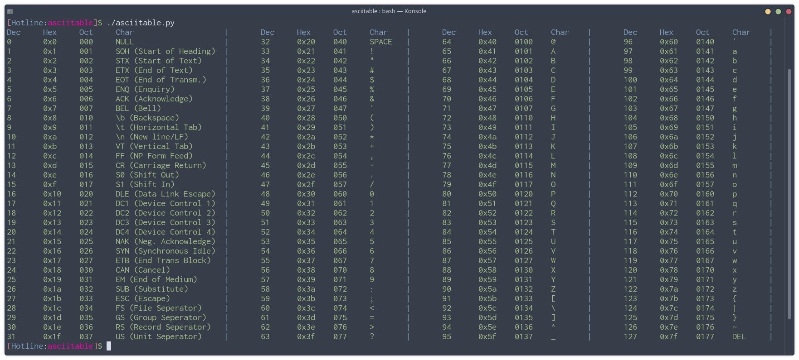
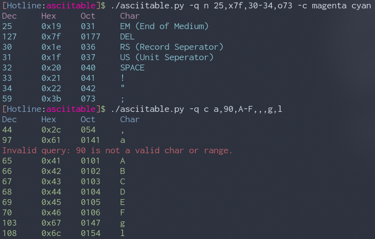

# asciitable
Python3 script with no dependencies that prints (colourfully :D) the ASCII table like asciitable.com, with quering features.



## Why? 

I got bored of going to [asciitable.com](http://www.asciitable.com/) everytime I needed to look at a couple of ASCII characters.
I also had no idea that you can run `man ascii` on GNU systems and get an ascii table.

## How to Run

Run it with ```./asciitable.py``` or ```python3 asciitable.py```

You can also give it specific ranges or characters to print like:



Check the options here:
```
asciitable.py - ASCII Table Printer

            Usage: asciitable.py [options]

                Prints the standard ASCII table from (0-127).

            Options:
                -h/--help - Print this help
                -q/--query [type] [value]
                   Used to query on rows and ranges from the ascii table.
                   type can be c/char for characters or n/number for numbers.
                   value is the value you  are making the query for.
                   values can be comma separated or ranges seperated by a '-'
                   use x for hex, o for octal, and insert characters as is.
                   Examples:
                        asciitable.py -q c @                    "querying for the character @"
                        asciitable.py -q c A-F,~                "querying for ranges A to F and ~"
                        asciitable.py -q n x15                  "querying for hex 15"
                        asciitable.py -q n o7                   "querying for oct 7"
                        asciitable.py -q n 17                   "querying for 17"
                        asciitable.py -q n 20,x50-x54,o22       "querying for 20 decimal, ranges 50-54 hex, and octal 22"

                -nc/--no-colour - Disable Colours
                -c/--colours [tablecolour] [textcolour]
                        Choose the colours for the table. (Default: blue green)
                        (magenta, blue, green, yellow, red, cyan, black, white)

```

You can also copy it to `/usr/bin` like:

`sudo cp asciitable.py /usr/bin/asciitable`

Or you could make an alias for it using your preferred shell by adding this line to the rc file (.bashrc for example):

`alias asciitable="/path/to/asciitable.py"`


Go nuts with it, enjoy 😃!

Contributions are more than welcome, as usual.
